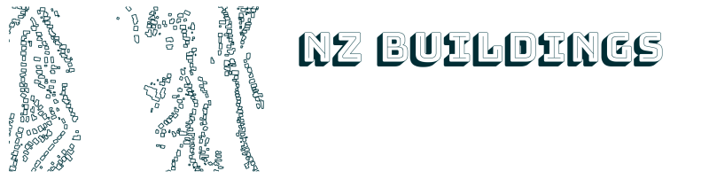

****

.. image:: https://github.com/linz/nz-buildings/workflows/Build/badge.svg
    :target: https://github.com/linz/nz-buildings/actions
    :alt: CI Status
    
.. image:: https://readthedocs.org/projects/nz-buildings/badge/?version=latest
    :target: https://nz-buildings.readthedocs.io/en/latest/introduction.html
    :alt: Documentation Status

.. image:: https://badgen.net/github/release/linz/nz-buildings?label=Release&labelColor=2e3a44&color=5cc3db
    :target: https://github.com/linz/nz-buildings/releases
    :alt: Latest Release

.. image:: https://badgen.net/badge/Building%20Outlines/3%2C115%2C271?labelColor=2e3a44&color=5cc3db
    :target: https://data.linz.govt.nz/layer/101290
    :alt: Current Building Outlines Feature Count

.. image:: https://badgen.net/dependabot/linz/nz-buildings?icon=dependabot&labelColor=2e3a44&color=blue
    :target: https://dependabot.com
    :alt: Dependabot Status

.. image:: https://badgen.net/badge/License/BSD%203-clause?labelColor=2e3a44&color=blue
    :target: https://github.com/linz/nz-buildings/blob/master/LICENSE
    :alt: License

.. image:: https://badgen.net/badge/Commits/conventional?labelColor=2e3a44&color=EC5772
    :target: https://conventionalcommits.org
    :alt: Convetional Commits

.. image:: https://badgen.net/badge/Code%20Style/black?labelColor=2e3a44&color=000000
    :target: https://github.com/psf/black
    :alt: Code Style

============
NZ Buildings
============

The *NZ Buildings* system is used to manage New Zealand's national building outlines dataset. This dataset is published under CC-BY-4.0 `on the LINZ Data Service`_.

.. _`on the LINZ Data Service`: https://data.linz.govt.nz/layer/101290

Features
========

The Topography team at `Land Information New Zealand`_ built this system and use it to:

- validate building outlines captured via feature extraction
- assign additional attributes (capture metadata, administrative boundaries)
- manually add, modify or delete building outlines where required
- compare a new set of building outlines against existing building outlines and categorise matching, added, removed or related buildings
- manage the lifecycle of building outlines across multiple data captures
- prepare data to be published on the LINZ Data Service

.. _`Land Information New Zealand`: https://www.linz.govt.nz/

Components
==========

- A PostgreSQL_/PostGIS_ database schema for data storage
- A QGIS_ plugin for data maintenance
- A data dictionary hosted on readthedocs
- ISO 19115 geospatial metadata to accompany the published datasets
- Dockerfiles of specific PostgreSQL versions and dependencies used for testing.

All of the components build upon other free and open source software. See `ACKNOWLEDGEMENTS.rst`_ for a summary.

.. _PostgreSQL: https://www.postgresql.org/
.. _PostGIS: https://postgis.net/
.. _QGIS: https://qgis.org/
.. _`ACKNOWLEDGEMENTS.rst`: ACKNOWLEDGEMENTS.rst

Database
========

The database for the *NZ Buildings* system is a PostgreSQL database with the PostGIS database extension for handling geographic objects.

Dependencies
------------

- PostgreSQL_ database with PostGIS_ extension. Tested versions are PostgreSQL 9.3 with PostGIS 2.3, and PostgreSQL 14 with PostGIS 3.2.
- Sqitch_ is used for database schema migrations.
- pgTAP_ is used for database testing. This is included inside the Dockerfiles used for automated testing.
- Docker_ is used for automated testing, of both QGIS plugin unit tests, and database tests using pgTAP.

.. _PostgreSQL: https://www.postgresql.org/
.. _PostGIS: https://postgis.net/
.. _Sqitch: https://sqitch.org/docs/
.. _pgTAP: https://pgtap.org/
.. _Docker: https://www.docker.com/

Installation
------------

First install the project into the OS data share directory:

.. code-block:: shell

    sudo make install

Then you can load the schema into a target database:

.. code-block:: shell

    nz-buildings-load $DB_NAME

NOTE: the loader script will expect to find SQL scripts under ``/usr/share/nz-buildings/sql``, if you want them found in a different directory you can set the ``BUILDINGSCHEMA_SQLDIR`` environment variable.

Upgrade
-------

The ``nz-buildings-load`` script will also upgrade as it currently replaces the existing schema. All data will be lost.

Development
-----------

For development, creating an alias that reinstalls scripts, rebuilds a test database and re-runs tests locally is helpful. 

.. code-block:: shell

    alias buildingsdb='cd $DEV/nz-buildings && sudo make uninstall clean install && make check && cd -'

``$DEV`` is the directory that ``nz-buildings`` has been cloned into.

Testing
-------

Testing uses pgTAP_ via ``pg_prove``.

.. code-block:: shell

    make check

A database called ``nz-buildings-pgtap-db`` is created with some test data in order to run the tests.

`GitHub Actions`_ is used for continuous integration.

.. _pgTAP: https://pgtap.org/
.. _`GitHub Actions`: https://github.com/linz/nz-buildings/actions

QGIS Plugin
===========

Dependencies
------------

The QGIS plugin is tested in QGIS versions 3.10, 3.16, and 3.24.

Installation
------------

The plugin can be installed in the local plugin folder from this repository.

.. code-block:: shell

    make deploy

Development
-----------

Clone, then create and activate a virtual environment.

.. code-block:: shell

    python3 -m venv .venv
    source .venv/bin/activate

``python3`` must be 3.6+.

Upgrade ``pip`` and install the required dependencies.

.. code-block:: shell

    pip install --upgrade pip
    pip install -r requirements-dev.txt
I
Install ``commit-msg`` git hook.

.. code-block:: shell

    pre-commit install --hook-type commit-msg

Creating a symlink from the repo to the local QGIS plugin directory makes it easy to evaluate changes to QGIS plugin code.

.. code-block:: shell

    ln -s $DEV/nz-buildings/buildings $HOME/.local/share/QGIS/QGIS3/profiles/default/python/plugins

Testing
-------

Testing uses Python ``unittest`` inside a real QGIS instance.

Individual test cases can be executed within QGIS by using the `Script Assistant`_ plugin, which will reload a test every time it is executed to allow ease of writing tests and checking their output.

GitHub Actions and the `QGIS Testing Environment`_ are used for continuous integration.

.. _`Script Assistant`: https://plugins.qgis.org/plugins/scriptassistant/ 
.. _`QGIS Testing Environment`: https://hub.docker.com/r/qgis/qgis

Data Dictionary
===============

The `NZ Buildings Data Dictionary`_ is automatically built on every commit to ``master``.

DOCUMENTATION.rst_ details the source code requirements in order create a valid data dictionary.

.. _`NZ Buildings Data Dictionary`: 
.. _DOCUMENTATION.rst: db/docs/source/DOCUMENTATION.rst

License
=======

This system is under the 3-clause BSD License, except where otherwise specified.
See the LICENSE_ file for more details.

.. _LICENSE: LICENSE
