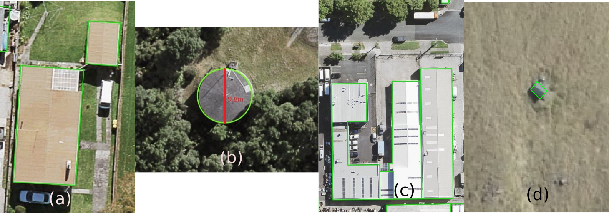
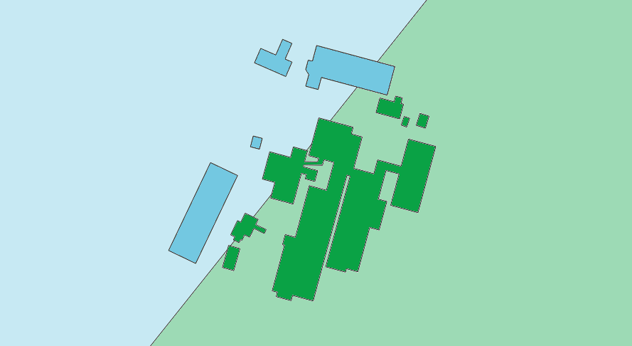
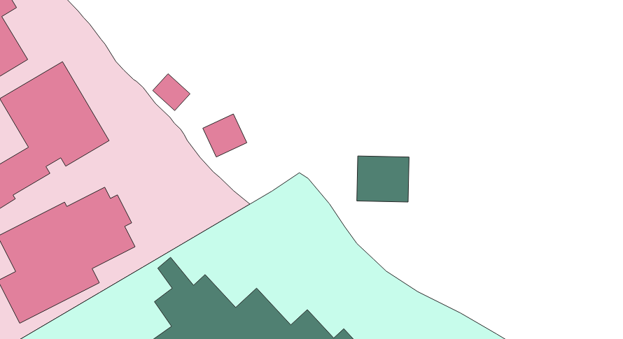

.. _introduction:

Introduction
=============================

Purpose
-----------------------------

This document provides detailed metadata (data dictionary) for the NZ Building Outlines data published on the LINZ Data Service: https://data.linz.govt.nz/layer/101290

Background
----------------------------

Building outlines have been identified as a dataset of national importance. They influence a multitude of decisions made across New Zealand at both the national and regional levels. It is therefore critical to have a consistent and dynamic dataset available. In 2016 LINZ conducted a pilot project to capture building outlines over three regions of New Zealand (Canterbury, Hawke’s Bay and Waikato). A survey was sent out to assess users’ opinion and determine the usefulness and suitability of the data for their purposes. The majority of the respondents (90%) to the survey agreed that the data is useful for their organisation. Many commented that the data is better than existing data, it is fit for purpose, and has become invaluable when enriched with other datasets. LINZ will continue to procure building outlines aligning with aerial imagery capture. This building outline dataset will provide a foundation for various stakeholders to map risk modelling, environmental assessment, urban development, resilience planning in addition to the visualization and physical location of buildings.
Over the next decade, the LINZ Topography Team is working towards its vision of recognising the way location information can help unlock new patterns and knowledge, particularly when it is combined with other types of information. One of our `strategic goals <https://www.linz.govt.nz/about-linz/publications/strategy/topographic-strategy-2015>`_ is to improve national scale datasets and maximize their opportunities for reuse by a variety of national and regional stakeholders.

The current Topo50 data for buildings is represented by either a `building polygon <https://data.linz.govt.nz/layer/50246-nz-building-polygons-topo-150k/>`_ or a `building point <https://data.linz.govt.nz/layer/50245-nz-building-points-topo-150k/>`_ . A building polygon is used to represent a structure that is large enough to be captured at 1:50,000 scale and has an area of 625m² or greater. The central business districts of large towns and cities is held in the LINZ building data as large building polygons. It is shown on the 1:50,000 scale printed maps as black fill, and is a generalized view, not showing individual buildings, or open spaces between buildings. A building point is used to represent a building with an area too small to be captured as a polygon feature at 1:50,000 scale.

The NZ Building Outlines data described below represents the outlines of individual buildings as polygons, as visible in the imagery as resolution allows, and not generalized for more urban areas as described above for the current Topo50 building polygons.

Description
---------------------------

This dataset consists of building outlines within mainland New Zealand. This is not a complete set and will be added to as new imagery becomes available. Current coverage includes areas in Northland, Auckland, Waikato, Bay of Plenty, Gisborne, Hawke’s Bay, Manawatu-Whanganui, Wellington, Tasman, Nelson, West Coast, Taranaki, Marlborough, Canterbury, Southland and Otago (See coverage maps below for more detail).

This dataset includes the spatial coverage of building outlines using remotely sensed information. A building outline is a 2D representation of the roof outline of buildings which have been classified from aerial imagery using a combination of automated and manual processes to extract and orthogonalise building roof outlines. Structures greater than or equal to 10 square meters are captured in this dataset, with exception in National Parks, Conservation Areas, and Wildlife Areas. Each building polygon represents a building outline and this may include spaces such as garages and large sheds. The building outlines represented in this dataset should not be confused with *building footprints*, which are 2D representations of where a building touches the ground.

.. figure:: _static/footprint.png
   :scale: 100 %
   :alt: comparison of footprint with building outlines

   Image 1. Example of a building outline versus a building footprint.

Building outlines data are defined by the following criteria:

* Buildings under construction, caravans, trailers, house boats, shipping containers and other mobile structures are not captured as building outlines.
* Primary building structures are captured as separate building outline polygons from adjoining building structures, such as garages (see Image 2a)
* Building extensions, sunrooms, balconies, patios and annexes are captured as part of the primary building outline structure if they exist as part of multi-level buildings and if sufficient imagery resolution allows this determination.
* Permanent building structures such as sheds and greenhouses >10sq meters, not attached to a primary building structure, are captured as a separate building outline.
* Adjoining townhouses are not captured as separate structures, but rather as joined primary structures.
* Adjoining commercial buildings are captured as separate building outlines when rooflines allow delineation (see Image 2c).
* Building outline polygons captured will be greater than 10 square meters. An exception to this is in national parks, conservation areas, and wildlife areas where small structures such as huts, bivies and shelters are included as building outlines to address safety concerns in remote locations (see Image 2d).
* Water tanks are captured as building outlines when their size is at least 16.5 square metres, or 4.5 meters in diameter (see Image 2b).

   Image 2. Examples of building outlines. (a) An example of a home and garage as separate outlines. (b) An example of a tank outline which is greater than the 4.5 meter diameter threshold. In this case the diameter shown in red is 7.2 meters. (c) An example of an adjoining commercial building outlines. (d) An example of a small remote hut located in a conservation area.

The publicly available building outlines data consists of three tables. The `NZ Building Outlines <https://nz-buildings.readthedocs.io/en/latest/published_data.html#table-nz-building-outlines>`_ table contains all of the building outlines which match the most recent imagery available for each region of the country. The `NZ Building Outlines All Sources <https://nz-buildings.readthedocs.io/en/latest/published_data.html#table-nz-building-outlines-all-sources>`_ table contains all building outlines that have been delineated from every imagery year/set that has been captured, whether this is historical imagery or the most recent imagery. The `NZ Building Outlines Lifecycle <https://nz-buildings.readthedocs.io/en/latest/published_data.html#table-nz-building-outlines-lifecycle>`_ table provides building_id relationship information buildings that are split or merged.

Source Imagery
---------------------------

The source imagery is linked via the ``capture_source_id`` attribute of building outlines to the ``imagery_survey_id`` of NZ Aerial Surveys. Using this link, additional attributes can be connected to building outlines - for example the dates that the imagery was captured and the accuracy / ground sample distance of the imagery used.

The NZ Aerial Surveys data dictionary is here: https://nz-imagery-surveys.readthedocs.io/en/latest/index.html

Suburbs & Localities
--------------------

Published building outlines include the attribute ``suburb_locality`` which provides the suburb or locality name as sourced from NZ Localities (an NZ Fire Service owned dataset). A derived suburb or locality name may not be the official geographic name for the geographic area that a building occupies.

The attributed name may refer to suburbs, localities, islands and parks / reserves. Water features such as coastal bays, lakes and inland bays are not included.

If a building outline intersects two localities, the locality with larger area of intersection is used for that feature.

   Image 3. Example of a building outline intersecting two localities.

For building outlines on water and not within any locality, the nearest locality is used for that feature.

   Image 4. Examples of building outlines not within any locality.

Coverage Maps
---------------------------

The NZ Building Outlines dataset is being procured and released in stages. Image 5 shows the current coverage of building outlines in green available on the `LINZ Data Service <https://data.linz.govt.nz/layer/101290>`_.

+-------------------------------------------------------------+
| .. figure:: _static/coverage_map_current.png                |
|    :scale: 40%                                              |
|    :alt: current building outlines coverage                 |
|                                                             |
|    Image 5: Map of current dataset coverage.                |
|                                                             |
+-------------------------------------------------------------+

Accuracy Specification
---------------------------

The Building Outlines contain spatial detail reflective of 90% to 110% of the visible characteristics of building roof outlines as shown in the source imagery . Outlines are captured in full where they are partially occluded by vegetation or require additional viewer interpretation, and squared off at 90 degrees if the corner angles are between 80-100 degrees. Effort has been made to adhere to the building outline criteria described above, and future updates may include adjustments of building outlines as imagery resolution allows.

Valid Geometry
---------------------------

A building outline polygon is considered to have valid geometry if:

* It does not overlap with any other current building outline polygon
* It does not contain any spikes (a series of vertices which create an extremely acute angle)
* It does not contain lines that are intersected with each other
* It can contain polygons with interior rings (holes)
* It does not contain polygons with multiple exterior rings

Formats
---------------------------

Textual data uses UTF-8 character encoding.

The source geometry of all spatial data uses NZGD2000 / New Zealand Transverse Mercator 2000 (EPSG 2193) as the spatial reference system.

Definitions
---------------------------

.. table::
   :class: manual

+-------------------+----------------------------------------------------------------------+
| Term              | Description                                                          |
+===================+======================================================================+
| LDS               | LINZ Data Service                                                    |
+-------------------+----------------------------------------------------------------------+
| Building          | A structure generally permanent in nature which has been constructed |
|                   | to meet a specific objective (e.g. housing, storage, and workplace). |
|                   |                                                                      |
+-------------------+----------------------------------------------------------------------+
| Building Outlines | A building outline is a 2D representation of the roof outline of a   |
|                   | building.                                                            |
|                   |                                                                      |
+-------------------+----------------------------------------------------------------------+

