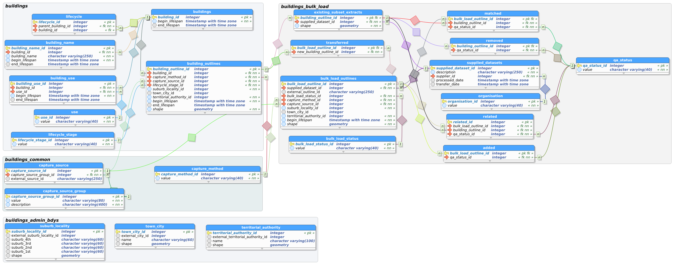

.. _internal_data:

Internal Data
================================

The information below describes the data model for building outlines for internal LINZ purposes.

Data Model
--------------------------------

To assist you in understanding these datasets, the structure and details of the data fields is described in tables below. The relationship between tables and directly related datasets is provided in a data model diagram. No attempt has been made to indicate cardinality, however, the arrows drawn between datasets point from the dataset containing the unique record, to the dataset that may contain one or more references to that record (i.e. primary key -> foreign key). 

To enable changes between updates to be recorded and then queried using the LDS changeset service, every table has a primary key. Primary keys are shown by a bolded field name. Tables can also have unique keys, which are shown by a bolded field name. 

This data model has been designed to manage building data with multiple representations, allowing for future enhancements in building data management. Not all of this data is currently available and data capture for these new fields will occur over time.

Schema: {{ schema_gen_buildings["name"] }}
----------------------------------------------------

Description: {{ schema_gen_buildings["comment"] }}


.. _table-name-{{item.table_nam}}:

Table: {{ item.table_nam }}
^^^^^^^^^^^^^^^^^^^^^^^^^^^^^^^^^^^^^^^^^^^^^^^
	
Description: {{ item.table_comment }}

		{{ column }}
		
	      
		



Schema: {{ schema_gen_buildings_common["name"] }}
-------------------------------------------------------

Description: {{ schema_gen_buildings_common["comment"] }}


.. _table-name-{{item.table_nam}}:

Table: {{ item.table_nam }}
^^^^^^^^^^^^^^^^^^^^^^^^^^^^^^^^^^^^^^^^^^^^^^^^^^^^^^^^^^^^^^^^^^^^^^^^^^^

Description: {{ item.table_comment }}

		{{ column }}
		
	      
		



Schema: {{ schema_gen_buildings_bulk_load["name"] }}
-------------------------------------------------------

Description: {{ schema_gen_buildings_bulk_load["comment"] }}


.. _table-name-{{item.table_nam}}:

Table: {{ item.table_nam }}
^^^^^^^^^^^^^^^^^^^^^^^^^^^^^^^^^^^^^^^^^^^^^^^^^^^^^^^^^^^^^^^^^^^^^^^^^^^^^
	
Description: {{ item.table_comment }}

		{{ column }}
		
	      
		



Schema: {{ schema_gen_buildings_admin_bdys["name"] }}
-------------------------------------------------------

Description: {{ schema_gen_buildings_admin_bdys["comment"] }}


.. _table-name-{{item.table_nam}}:

Table: {{ item.table_nam }}
^^^^^^^^^^^^^^^^^^^^^^^^^^^^^^^^^^^^^^^^^^^^^^^^^^^^^^^^^^^^^^^^^^^^^^^^^^^^^
	
Description: {{ item.table_comment }}

		{{ column }}
		
	      
		


