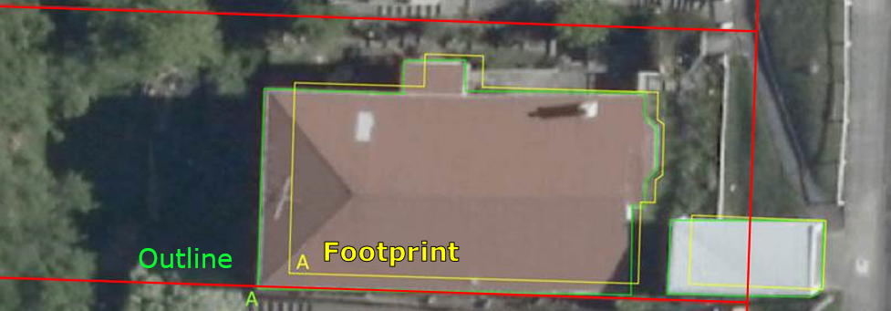

.. _introduction:

Introduction
=============================

Purpose
-----------------------------

This document provides detailed metadata (data dictionary) for the NZ Buildings data published on the LINZ Data Service.

Background
----------------------------

Over the next decade, the LINZ Topographic Office is working towards its vision of recognising the way location information can help unlock new patterns and knowledge, particularly when it is combined with other types of information. One of our strategic goals is to improve national scale datasets and maximize their opportunities for reuse by a variety of national and regional stakeholders.

Building outlines have been identified as a dataset of national importance, and influence a multitude of decisions made across New Zealand at both the national and regional levels. It is therefore critical to have a consistent and dynamic dataset available. This building outline dataset will provide a foundation for various stakeholders to map risk modelling, environmental assessment, urban development, resilience planning in addition to the visualization and physical location of buildings. 

Description
---------------------------

This dataset includes the spatial coverage of buildings outlines using remotely sensed information. A building outline is a 2D representation of the roof outline of buildings which have been classified from remotely sensed information using a combination of automated and manual processes to extract and orthogonalise building roof outlines and identifies every structure greater than or equal to 10 square meters. These processes use electromagnetic radiation reflectance in the red, green and blue bands (visible bands) to classify pixels based on known patterns of signal combinations from various building roof materials. It may include spaces such as decks, garages and porches. Each building polygon represents a building outline. The building outlines represented in this dataset should not be confused with *building footprints*, which are 2D representations of where a building touches the ground. 

   Image 1. Example of a building outline versus a building footprint.

The current Topo50 data for buildings is represented by either a `building polygon <https://data.linz.govt.nz/layer/50246-nz-building-polygons-topo-150k/>`_ or a `building point <https://data.linz.govt.nz/layer/50245-nz-building-points-topo-150k/>`_ . A building polygon is used to represent a structure that is large enough to be captured at 1:50,000 scale and has an area of 25m² or greater. The central business districts of large towns and cities is held in the LINZ building data as large building polygons. It is shown on the printed maps as black fill, and is a generalized view, not showing individual buildings, or open spaces between buildings. A building point is used to represent a building with an area too small to be captured as a polygon feature at 1:50,000 scale.

The building outlines data described here represents the outlines of individual buildings as polygons, as visible in the imagery, and not generalized for more urban areas.

Building polygons in the building outlines data are defined by the following criteria:

* Buildings under construction are not captured as building outlines.
* Primary building structures are captured as separate building outline polygons from adjoining building structure polygons.
* Building extensions, sunrooms, balconies, patios and annexes are captured as part of the primary building outline structure if resolution of imagery allows.
* Permanent building structures such as sheds and greenhouses, not attached to a primary building structure, but larger than 10 square meters is captured as a separate building outline polygon.
* Adjoining townhouses are not captured as separate structures, but rather as joined primary structures.
* Adjoining commercial buildings are captured as separate building outlines when rooflines allows delineation.
* Water tanks are captured as building outlines when their size is at least 16.5 square metres.

Source Imagery
---------------------------

Resolution of imagery used for capture of building outlines ranges from 50cm pixel resolution (0.5m GSD) to 10cm pixel resolution (0.1m GSD).

Accuracy Specification
---------------------------

The Building Outlines contain spatial detail reflective of the visible characteristics of building outlines as seen from the source imagery to an accuracy of 1 metre. Outlines are captured in full where they are partially occluded by vegetation or require additional viewer interpretation, and squared off at 90 degrees if the corner angles are between 80-100 degrees.

File format
---------------------------

Aspatial data is provided in UTF-8 format. The source geometry of all spatial tables is NZGD2000 (New Zealand Geodetic Datum 2000)..

Definitions
---------------------------

.. table::
   :class: manual

+-------------------+----------------------------------------------------------------------+
| Term              | Description                                                          |
+===================+======================================================================+
| Aspatial          | Data that is not related to a spatial geometry                       |
+-------------------+----------------------------------------------------------------------+
| LDS               | LINZ Data Service                                                    |
+-------------------+----------------------------------------------------------------------+
| Building          | A structure generally permanent in nature which has been constructed |
|                   | to meet a specific objective (e.g. housing, storage, and workplace)  |
|                   | and less permanent structures such as caravans and other portable    |
|                   | housing may also be represented.                                     |
+-------------------+----------------------------------------------------------------------+
| Building Outlines | Building Outlines are a digital representation of the roof outlines  |
|                   | of a buildings which have been classified from remotely              |
|                   | sensed information that identifies every building structure that is  |
|                   | greater than 10 square meters and falls within an area of the        |
|                   | capture of buildings.                                                |
+-------------------+----------------------------------------------------------------------+

